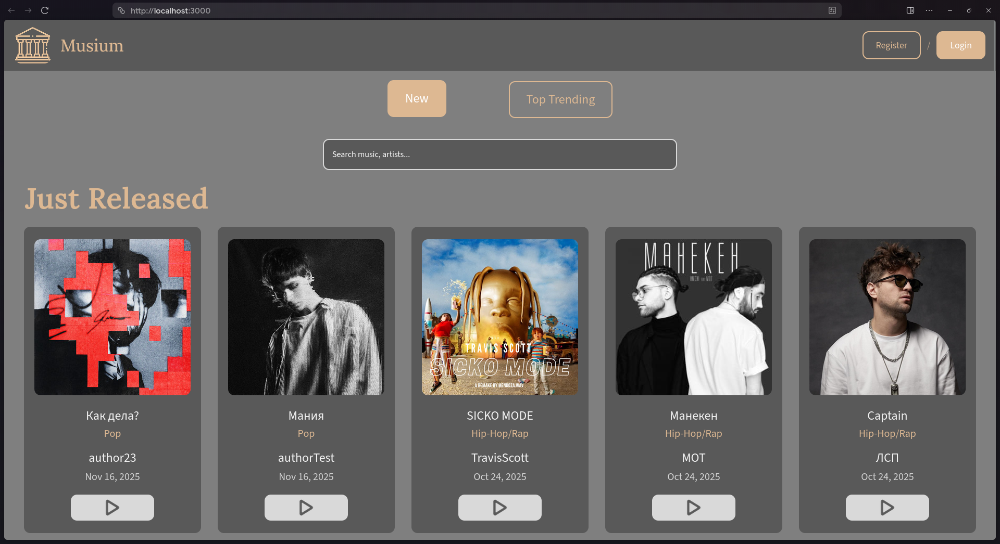

# 🎵 Musium



## 📋 Project Overview

Musium is a comprehensive music platform developed as part of the **2nd year Object-oriented Programming and Design curriculum**. This project represents a culmination of skills acquired throughout the course, demonstrating practical implementation of OOP principles in a full-stack web application.

### ✨ Key Features
- 🎼 Music catalog with trending and new releases  
- 👤 User authentication and profile management
- 🎤 Author/artist panels for content management
- ⚙️ Admin dashboard for system administration
- 🔍 Search functionality
- 📱 Responsive web design

## 🛠 Technology Stack

### 🔧 Backend & Runtime


### 🎨 Frontend & Styling


### 🗄️ Database & Infrastructure


## 📁 Project Structure

```
musium/
├── 🚀 app.js               # Main application entry point
├── ⚡ bin/www              # Server startup script
├── ⚙️ config/              # Database configuration
├── 🎮 controllers/         # MVC Controllers
├── 🗃️ database/            # SQL scripts
├── 🏭 factories/           # Design Pattern Implementations
├── 🔒 middlewares/         # Express middlewares
├── 💾 repositories/        # Data access layer
├── 🛣️ routes/              # Application routes
├── 🔧 services/            # Business logic layer
├── 📁 public/              # Static assets (Fonts, JS, SCCS, images)
├── 👁️ views/               # EJS templates
├── 🐳 docker-compose.yml   # Docker configuration
└── 🐳 Dockerfile           # Docker commands
```

## 💻 System Requirements

### 📊 Minimum Requirements
- **💻 OS:** Windows 10/11, macOS 15+, any Linux distribution
- **⚡ Processor:** Intel Core i5-3320M or equivalent and newer
- **🧠 RAM:** 4GB or higher
- **💾 Storage:** 1GB available space
- **🌐 Network:** 10Mbit/s or faster

### 🚀 Recommended
- **🧠 RAM:** 8GB or higher
- **💾 Storage:** 2GB available space (SSD recommended)

## ⚡ Installation Guide

### 📋 Prerequisites
- 🐳 Docker Desktop installed on your system
- 🔧 Git for repository cloning

### 🛠️ Step-by-Step Setup

1. **📥 Clone the Repository**
   ```bash
   git clone <repository-url>
   cd musium
   ```

2. **⚙️ Environment Configuration**
   ```bash
   # Copy the environment template
   cp .env.example .env
   
   # Edit the .env file with your preferred text editor
   # Configure database credentials and other settings
   ```

3. **🐳 Docker Installation**
    - **🍎 macOS:** [Docker Desktop for Mac](https://docs.docker.com/desktop/setup/install/mac-install/)
    - **🪟 Windows:** [Docker Desktop for Windows](https://docs.docker.com/desktop/setup/install/windows-install/)
    - **🐧 Linux:** [Docker Engine](https://docs.docker.com/engine/install/) or [Docker Desktop](https://docs.docker.com/desktop/setup/install/linux/)

4. **🚀 Application Deployment**
   ```bash
   # Build and start all services
   docker compose up --build
   
   # For detached mode (running in background)
   docker compose up --build -d
   ```

5. **🌐 Access the Application**
    - 🎵 Main application: http://localhost:3000
    - 🗃️ PgAdmin (database management): http://localhost:8080

## 🗃️ Database Configuration (PgAdmin)

1. 📊 Open PgAdmin at http://localhost:8080
2. 🔐 Login with credentials from your `.env` file
3. ➕ Register a new server:
    - **General Tab:**
        - Name: `Musium`
    - **Connection Tab:**
        - Host: `Name from docker-compose.yml (basically, db)`
        - Port: `5432`
        - Maintenance Database: `[DB_NAME from .env]`
        - Username: `[DB_USER from .env]`
        - Password: `[DB_PASSWORD from .env]`
4. 💾 Click **Save** to establish connection

## ⚡ Management Commands

### 🚀 Starting Services
```bash
docker compose start
```

### ⏹️ Stopping Services
```bash
docker compose stop
```

### 🧹 Complete Teardown
```bash
# Stops containers and removes volumes
docker compose down -v
```

### 📋 View Logs
```bash
docker compose logs -f
```

### 🔨 Development Mode
```bash
# Access application container
docker compose exec app bash

# Install dependencies (if needed)
npm install
```

## ❗ Troubleshooting

### 🔧 Common Issues
1. **🔌 Port conflicts:**
    - Ensure ports 3000 and 8080 are available
    - Modify ports in `docker-compose.yml` if needed

2. **🗃️ Database connection errors:**
    - Verify PostgreSQL service is running
    - Check credentials in `.env` file

3. **🏗️ Build failures:**
    - Clear Docker cache: `docker system prune`
    - Rebuild from scratch: `docker compose build --no-cache`

### 🆘 Getting Help
- 📊 Check application logs: `docker compose logs app`
- 🗃️ Check database logs: `docker compose logs db`
- ✅ Verify container status: `docker compose ps`

## 💻 Development
For development with hot-reload:
```bash
# Install dependencies locally
npm install

# Start development server
npm run dev
```

## 🙏 Credits
- 🎨 [Icons8](https://icons8.ru/) - Icons and graphics
- 🔤 [Google Fonts](https://fonts.google.com/) - Typography
- 🎧 [Spotify](https://open.spotify.com/) - Design inspiration